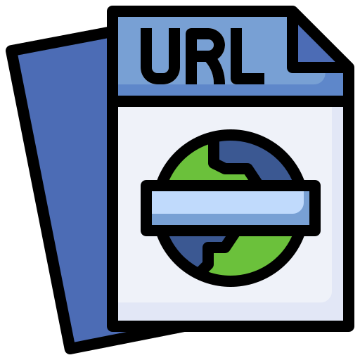

# CQL Filter to QGIS Filter request Plugin
 Icon created by surang - Flaticon

---
### QGIS server plugin that intercepts and transforms a <code>CQL_FILTER</code> (Geoserver standard) WMS request to QGIS server-compatible <code>FILTER</code> request

CQL_FILTER (Geoserver) and FILTER (QGIS-server) syntax differ. This plugin can be used to use an off-the-shelf web-viewer that uses Geoserver filter syntax for your QGIS server WMS layers.

**The request:**

<code>http://qgis.demo/cgi-bin/qgis_mapserv.fcgi?{..}&LAYERS=countries&CQL_FILTER=name='France'</code>

**gets intercepted and becomes:**

<code>http://qgis.demo/cgi-bin/qgis_mapserv.fcgi?{..}&LAYERS=countries&FILTER=countries:"name"%20=%20'France'</code>

**So that QGIS server is able to process the request as if it were a Geoserver layer.**

Note: The CQL_FILTER is also preserverd, so that the request still works for Geoserver layers as well. 

---

| Version | Date (dd-mm-yyyy) | Comment |
|:---------:|:------:|:---------:|
|0.1|18-10-2024|Test phase|
|1.0|17-01-2025|Major update and first release|

Icon 

---

### 🛠️ Usage
Useful when you don't have control over the construction of the query string, but do have access to the QGIS server the request is heading for. Also useful if you want to use a uniform WMS request that works for both Geoserver and QGIS server in your front-end app.

**Example:** 
For filtering a WMS layer in CQL syntax, the following is allowed:
<code>CQL_FILTER=name='France'</code>
<code>CQL_FILTER=name = 'France'</code>
<code>CQL_FILTER=(name='France')</code>

For filtering a WMS layer in QGIS syntax, only the following is allowed:
<code>FILTER=countries:"name" = 'France'</code>
<code>FILTER=countries:( "name" = 'France' )</code>

QGIS requests allow requesting multiple layers in a single request, therefore the layer needs to be specified. This plugin takes the first layer specified in the <code>LAYERS</code> parameter. Text strings have to be enclosed in single or double quotes. A space between each word/special character in mandatory.

If the transformation is succesful, the results will also be printed to the QGIS server logs.

**Limitations:**
- Arithmetic expressions don't work in QGIS-server
- Geometric filters are not yet supported in this version of the plugin
- The request can only handle one layer or typename per request

---

### 🔑 Supported keywords:
Keywords that can be used in the <code>CQL_FILTER</code> parameter and will successfully be transformed to a <code>FILTER</code> parameter:
- IS
- NOT
- NULL
- AND
- OR
- IN
- IN (layer.id2, layer.id1)
- =
- &lt;
- &gt;
- &lt;=
- &gt;=
- !=
- LIKE
- ILIKE
- BETWEEN
- % (wildcard symbol)
- (
- )
- [
- ]

In the future I would like to implement spatial filters as well. If you have more knowledge about how <code>FILTER_GEOM</code> works in QGIS server, please contact me (see source code for email address).

---

### ❓ How to install a QGIS server plugin?
**Manual installation:**
- QGIS server plugins can be downloaded from the official [QGIS python plugin repository](https://plugins.qgis.org/plugins/server/) or from the developers' code repositories.
- Set the environmental variable <code>PLUGINPATH</code> to the folder in which your plugins are stored. In the case of the official Docker QGIS server image this is <code>/usr/share/qgis/python/plugins</code>. 
- Place the folder containing the plugin in the plugins folder.
- Restart QGIS server to load the new plugins.

**Using QGIS-Plugin-Manager:**

- Go the the repository of the [QGIS-Plugin-Manager](https://github.com/3liz/qgis-plugin-manager/tree/master) command-line tool developed by [3Liz](https://www.3liz.com/en/) and follow the instructions.

Want to write your own plugin? See the documentation in the [PyQGIS Developers Cookbook](https://docs.qgis.org/3.34/en/docs/pyqgis_developer_cookbook/server.html#index-2).

---

### 📋 To Do

- Add geometric filters

Feel free to contribute any way you like!
